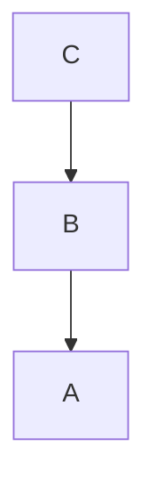

### 메소드, 힙, 스택영역

- 메소드 : 바이트코드 파일을 읽은 내용이 저장되는 영역(클래스 영역).
- 힙 : 객체가 생성되는 영역. 객체의 번지는 메소드 영역과 스택 영역의 상수와 변수에서 참조.
- 스택 : 메소드를 호출할 때마다 생성되는 프레임이 저장되는 영역.
    - 지역변수와 매개변수 저장. 매개변수들은 자동으로 초기화, 지역변수는 초기화하지 않으면 사용 불가능.

### String

```java
package com.bnk.base;

public class StringTest1 {

	public static void main(String[] args) {
		int i = 10;
		int j = 10;

		String s1 = new String("kim");
		String s2 = new String("kim");
		String s3 = "kim";
		String s4 = "kim";

		if (i == j) {
			System.out.println("i == j");
		}
		if (s1 == s2) {
			System.out.println("s1 == s2");
		}
		if (s4 == s3) {
			System.out.println("s3 == s4");
		}
		if (s1.equals(s4)) {
			System.out.println("s1 == s4");
		}
	}

}
```

```
결과값
i == j
s3 == s4
s1 == s4
```

- s1과 s2는 heap 영역에 객체가 따로 생성된다. 때문에 다른 객체를 가리키게 된다.
- **s3와 s4는 상수 취급되어 literal pool에 생성되고, 그 결과 똑같은 상수를 가리키게 된다.**
- 때문에 s1과 s3가 가진 ‘데이터’가 같은지 물어보고 싶다면, equals() 메소드를 사용해야 한다.


```java
package com.bnk.base;

public class StringTest2 {

	public static void main(String[] args) {
		String s1 = new String("kim");
		System.out.println(s1+30+40);
		System.out.println(30+40+s1);
		System.out.println(s1+'A'+30);
		System.out.println('A'+30+s1);
	}

}
```

```
결과값
kim3040
70kim
kimA30
95kim
```

- 문자열이 나오면 그 이후부터 문자열 연산함.

```java
package com.bnk.base;

public class StringTest3 {

	public static void main(String[] args) {
		String s1 = new String("kim");
		String s2 = s1+"Lee";
		String s3 = "kimLee";
		
		if(s2 == s3) {
			System.out.println("s2 == s3");
		}
		else if(s2.equals(s3)) {
			System.out.println("s2.equals(s3)");
		}
		
		
	}

}
```

```
결과값
s2.equals(s3)
```

- s1라는 객체가 있었고, s2는 StringBuilder 객체가 생성되어 s1에서 kim을 가져오고 거기에 Lee를 이어붙인다. 원래 String은 불변객체이므로 수정이 되지 않지만, StringBuilder를 통해서 문자열을 수정한다. 그 후 다시 String객체로 변환된다.
- 나중에 쓰지 않는 객체가 있다면, Garbage Collector에 의해서 삭제된다.
- String은 수정이 많이 되지 않는 문자열에 사용하며, StringBuilder는 수정이 많이 되는 문자열에 사용한다.
- 다만 StringBuilder는 +연산이 안되고, append를 통해 문자열을 추가한다.


### 제한자(Modifier)

1. 접근 제한자 : 누구에게 허용하겠는가?
    - private : 같은 클래스 내에서만 접근 가능.
    - default : 같은 패키지 내부까지 접근 가능.
    - protected : 상속을 받았다면, 자손 클래스까지 접근 가능.
    - public : 모두 접근 가능.
2. 사용 제한자
    - static : 멤버 변수, 클래스, 메소드에 붙을 수 있음. 일반 클래스에는 못 붙는다.
        - 멤버 변수에 붙으면 자손클래스에서도 사용할 수 있는 공용 변수가 됨.
        - 나머지 변수는 모두 new를 사용하지 않아도 됨.
    - final : 클래스, 변수, 메소드에 다 붙을 수 있음.
        - 클래스 앞에 붙으면 상속받을 수 없음.
        - 변수 앞에 붙으면 변경할 수 없음, 상수.
        - 메소드 앞에 붙으면 상속 시 수정 불가, 오버라이딩 불가능, 변경 불가.
    - abstract : 클래스, 메소드 앞에 붙을 수 있음.
        - 메소드 앞에 붙으면 미완성했으니, 자손 클래스에서 반드시 구현해야함.
        - 클래스 앞에 붙으면, 자손 클래스에서 구현해야함. 빚 같은 존재.
    
    
    
    
    
    - static 블록 : 클래스가 로딩될 때 사전작업을 하고 싶으면 사용.
    - 그냥 블록 : new 할 때마다 작업 하고 싶으면 사용. 그러나 생성자가 있으므로, 굳이 많이 사용하지는 않음.

### Encapsulation(캡슐화)

- 중요하거나 복잡한 것은 private를 통해 숨기고, 외부에서 사용이 꼭 필요한 기능만 public을 통해 공개한다.

### Overriding

- 상속받은 메소드를 다시 정의하는 것을 의미함.
- 리턴타입과 메소드명, 파라미터가 모두 같아야 한다.
- 리턴타입은 서브 타입 정의가 가능하다.
- Modifier는 더 작으면 안 된다.

### Polymorphism(다형성)



- B가 A를 상속하고, C가 B를 상속하고 모든 클래스가 m 메소드를 가지고 있을 때,

```java
A a1 = new A();
A a2 = new B();
A a3 = new C();

a1.m();
a2.m();
a3.m();
```

- a1.m()은 A클래스, a2.m()은 B클래스, a3.m()은 C클래스의 메소드가 실행된다.

```java
public Bus[] searchBus() {
		int cnt = 0;
		for(int i = 0; i<index; i++) {
			if(cars[i] instanceof Bus) {  //cars[i]에 Bus 인스턴스가 있는지?
				cnt ++;
			}
		}
		Bus[] result = new Bus[cnt];
		cnt = 0;
		for(int i = 0; i<index; i++) {
			if(cars[i] instanceof Bus) {  //cars[i]에 Bus 인스턴스가 있는지?
				result[cnt++] = (Bus)cars[i];
			}
		}
		return result;
	}
```
