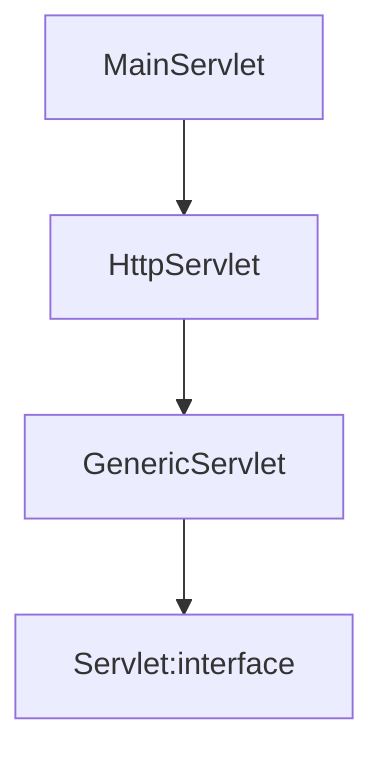

# 2023.09.11

# **9월 11일 학습목표**

- 웹 아키텍처를 이해
- Servlet 관련 객체를 이해
- Servlet 라이프 사이클을 이해
- 클라이언트로 부터 입력받은 데이터 처리

### 설계 지침

- Cohesion : 하나의 클래스는 하나의 목적에 맞게끔 설계 되어야 한다.
- Coupling : 객체들간의 관계성.
- Cohesion은 증가시키고, Coupling은 하락시킨다.

### MVC 패턴

- Model : 데이터 처리
- View : 화면 설계
- Controller : 요청 제어

### Get vs Post

- GET :  url에 다음과 같이 담겨서 보내짐 main.do?userid=1111&pw=111
- POST : [main.do](http://main.do) url에 정보가 담겨지지 않고 data 틀에 따로 담겨서 보내짐.

### Servlet?

- 클라이언트의 요청을 처리하고, 그 결과를 반환하는 Servlet 클래스의 구현 규칙을 지킨 자바 웹 프로그래밍 기술.
- 간단하게 말하면, 자바를 사용해서 웹을 만들기 위해 필요한 기술.
- 클라이언트의 요청에 대해 동적으로 작동하는 웹 어플리케이션 컴포넌트.
- html을 사용해서 요청에 응답함.
- MVC 패턴에서 Controller로 이용됨.

### Client - Server

1. 요청 메세지가 들어온다.
2. HSResponse와 HSRequest가 생기고 메세지를 처리한다.
3. main.do가 누구냐고 ServletContext에게 물어본다.
4. ServletContext가 MainServlet에 있다고 알려준다.
5. MainServlet이 메모리에 로딩되어 있는지 확인한다.
    1. 없다면 객체를 생성한다 .
    2. init()을 호출한다.
6. 스레드의 service()를 호출한다.
7. MainServlet에 service가 없다면, Form Method에 맞는 HttpServlet에 구현되어 있는 doGet()등의 메소드를 호출한다.
- HttpServletResponse/Request : 요청이 들어올 때 생기고 요청이 종료되면 사라진다.
- ServletContext : WebServlet

- init() : 서블릿이 처음으로 요청이 되어 객체가 생성 될 때 호출하는 메소드
- service() : 클라이언트가 요청이 있을 때마다 호출되는 메소드
- destroy() : 서블릿 서비스의 종료 및 재시작 그리고 서블릿 코드가 수정이 될 때 호출되는 메소드.

### Servlet이 하는 일***

- 요청이 무엇인지 파악한다.
- Client의 data를 추출한다.
- 요청을 처리한다. → Serivce나 DAO 호출해서 작업 진행함.
- 결과 데이터를 저장한다.
- 결과 페이지로 이동한다. → jsp 페이지 호출.

### Servlet의 생명주기

1. 클라이언트에 요청이 들어오면 컨테이너에 해당 서블릿이 메모리에 있는지 확인한다. 없을 경우에는 init()메소드를 호출하여 적재한다. 만약 메모리에 있는 경우에는 2번으로 바로 넘어간다.
2. 클라이언트의 요청에 따라 service()메소드를 통해 응답이 get이라면 doGet()메소드를 호출하고, post라면 doPost()를 호출한다. 
3. 컨테이너가 서블릿에 종료 요청을 하면 destory()메소드를 호출한다. 종료 시에 처리해야 하는 작업들을 destroy()메소드를 오버라이딩해서 구현한다.

### JSP

- 서블릿은 자카 소스코드 속에 HTML코드가 들어가는 형태지만, JSP는 반대로 HTML 소스코드 속에 자바 소스코드가 들어가는 구조를 가진다.
